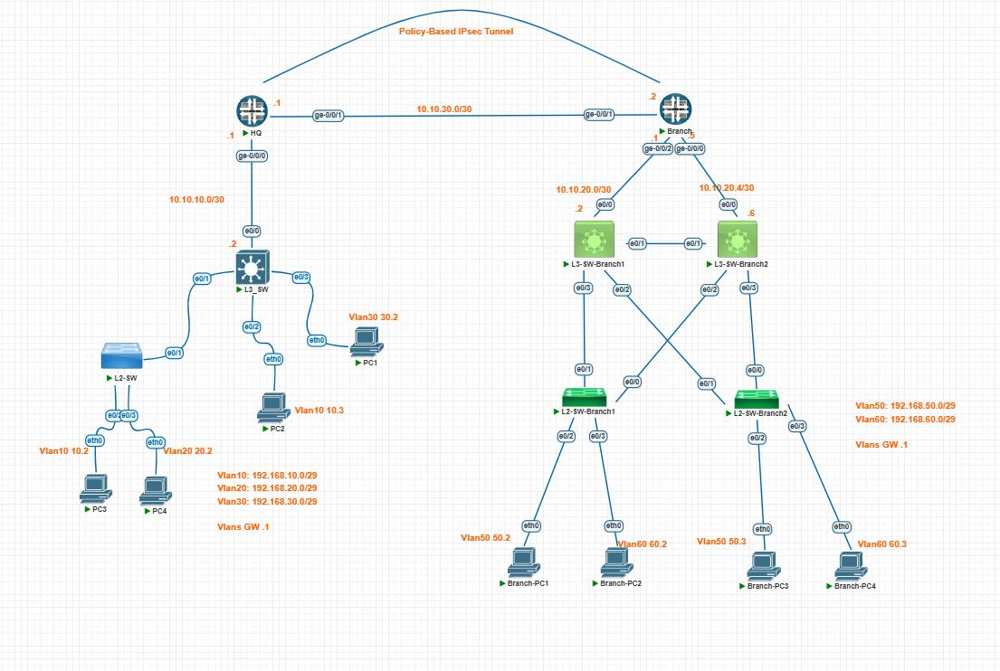

# Enterprise HQ-to-Branch IPsec VPN

## Overview

This project documents the integration of two independent enterprise network sites, **HQ** and **Branch**, using a **policy-based IPsec VPN** between their Juniper SRX firewalls.

The HQ and Branch environments were designed and documented as separate network projects. This repository focuses on the integration between the two sites and documents the configuration changes, routing requirements, troubleshooting process, and verification performed to establish end-to-end connectivity.

---

## Topology

The following diagram shows the complete HQ-to-Branch network integration:



---

## Project Scope

The integration includes:

- IKE Phase 1 configuration
- IPsec Phase 2 configuration
- Policy-based IPsec VPN configuration
- Security policy configuration
- Inter-site routing
- VPN and IPsec SA verification
- End-to-end connectivity testing
- Routing troubleshooting
- Floating backup path testing

---

## VPN Endpoints

| Device | Interface | Address |
|---|---|---|
| HQ-SRX | ge-0/0/1.0 | 10.10.30.1 |
| Branch-SRX | ge-0/0/1.0 | 10.10.30.2 |

The IPsec VPN is established between the two SRX firewalls over the WAN/transport network.

---

## Related Projects

This repository builds on two previously developed network environments:

- Enterprise HQ
- Enterprise Branch

Those projects document the internal network design of each site, while this repository focuses on connecting the two sites together.

---

## Repository Structure

```text
enterprise-hq-branch-ipsec/
│
├── README.md
│
├── configs/
│
├── docs/
│   └── images/
│       └── hq-branch-ipsec-topology.png
│
├── testing/
│
└── troubleshooting/
```

Detailed configuration, testing, and troubleshooting documentation will be added as the integration is documented.

---

## Project Status

### Completed

- HQ and Branch topology integration
- Policy-based IPsec VPN
- IKE Phase 1
- IPsec Phase 2
- Inter-site routing
- Bidirectional connectivity testing
- Floating backup path testing

### Documentation

The configuration and troubleshooting process is being documented progressively in this repository.
